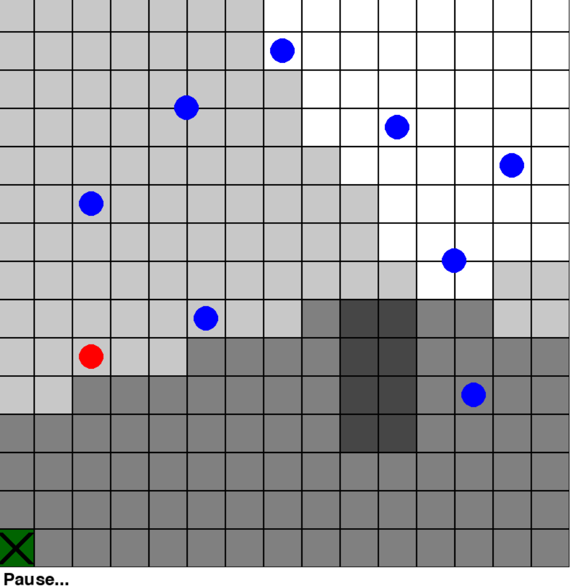

# UAV Trajectory Optimization using Reinforcement Learning

This project is based on the original implementation from the following repository and paper:
- **Original Repository**: [UAV-Trajectory-Optimization](https://github.com/original-repo) (reference repository)
- **Paper**: H. Bayerlein, P. De Kerret and D. Gesbert, "Trajectory Optimization for 
  Autonomous Flying Base Station via Reinforcement Learning," IEEE 19th 
  International Workshop on Signal Processing Advances in Wireless 
  Communications (SPAWC), 2018, pp. 1-5.

## Authors

This modified version was adapted and enhanced by:
- **Bahhou Marouane**
- **Benselloum Nizar**

## Modifications and Adaptations

This codebase has been modified from the original implementation to adapt it to our specific use case involving **Sensor Nodes (SNs)** instead of User Equipment (UEs). The following modifications have been made:

### 1. Terminology Changes
- **UE → SN**: All references to "User Equipment" (UE) have been changed to "Sensor Nodes" (SN) throughout the codebase
- Updated class names, variables, and documentation to reflect this change
- Modified `uavenv/uav2dgrid.py` to use `SN` class instead of `UE` class

### 2. Data Loading and Storage
- **Uploads Directory**: Modified JSON file loading to exclusively check the `uploads/` directory for pretrained models
- **Results Directory**: Added automatic saving of training results to `results/` directory in JSON format
- Updated `rl/qlearning.py` and `rl/sarsa.py` to load models only from `uploads/` directory
- Modified `uav.py` to automatically save training statistics after each run

### 3. Algorithm Comparison and Visualization
- **New Comparison Script**: Created `compare_algorithms.py` for automated algorithm comparison
- **KPI Plots**: Implemented separate KPI visualization plots saved to `results/plots/`:
  - KPI1.png: Reward After Episodes (learning curves)
  - KPI2.png: Average Flying Time
  - KPI3.png: Average Reward
  - KPI4.png: Min Max Reward Range
  - KPI5.png: Success Rate
- **Trajectory Visualization**: Added trajectory comparison plot (`Trajectories_Comparison.png`) that displays the best trajectory from each algorithm on the same 15×15 grid, showing obstacles, sensor nodes, and algorithm paths for visual comparison
- **Pandas Integration**: Used pandas DataFrames for improved data handling and analysis
- Automatic discovery of result files from the `results/` directory
- **Note on Algorithms**: The codebase implements Q-Learning (from the paper) and SARSA (added as an additional tabular method). DQN (Deep Q-Network) from the paper is not implemented in this version.

### 4. Code Structure Improvements
- Enhanced error handling for missing files and directories
- Improved file path management for cross-platform compatibility
- Better separation of concerns between data collection and visualization

## Usage

### Running Individual Algorithms

To run a specific algorithm, modify `uav.py` to select the desired algorithm:

```python
# For Random Action
ai = RandomAction()

# For SARSA
ai = SARSA(len(env.action_space), exploration=EXPLORATION_FLAG)

# For Q-Learning
ai = Q_Learning(len(env.action_space), exploration=EXPLORATION_FLAG)
```

Then run:
```bash
python uav.py
```

Training results will be automatically saved to `results/{Algorithm_Name}_results.json`.

### Comparing Algorithms

After running `uav.py` for each algorithm (Random Action, SARSA, and Q-Learning), you can generate comparison plots:

```bash
python compare_algorithms.py
```

This will:
1. Automatically find all result JSON files in the `results/` directory
2. Generate 5 separate KPI comparison plots
3. Generate a trajectory comparison plot showing the best trajectory for each algorithm
4. Save plots to `results/plots/`:
   - `KPI1.png`: Reward After Episodes
   - `KPI2.png`: Average Flying Time
   - `KPI3.png`: Average Reward
   - `KPI4.png`: Min Max Reward Range
   - `KPI5.png`: Success Rate
   - `Trajectories_Comparison.png`: Best Trajectories for the RL Algorithms (visualized on the same grid)

#### Trajectory Visualization

The `Trajectories_Comparison.png` plot provides a visual comparison of the best-performing trajectory from each RL algorithm on the same 15×15 grid. The plot includes:

- **Grid Layout**: 15×15 cell grid matching the simulation environment
- **Obstacles**: Dark grey rectangular blocks showing impassable areas
- **Sensor Nodes (SNs)**: Blue circles indicating the locations of all sensor nodes
- **Start/End Position**: Green square with 'X' marking the starting and landing position (left-bottom corner)
- **Algorithm Trajectories**: Each algorithm's best trajectory (highest reward episode) is displayed with:
  - **SARSA**: Blue line with square markers  
  - **Q-Learning**: Green line with triangle markers
- **Legend**: Shows algorithm name, episode number, and reward value for each trajectory

This visualization helps you understand:
- How each algorithm navigates around obstacles
- Which paths algorithms take to serve sensor nodes
- The efficiency and strategy differences between algorithms
- Whether algorithms successfully return to the landing position

### Loading Pretrained Models

You will find pretrained model files in the `uploads/` directory:
- `Q-Learning-load.json`
- `SARSA-load.json`

The code will automatically load these models when `LOAD_DATA_FLAG = True` in `uav.py`.

## Project Structure

```
UAV-Trajectory-Optimization-main/
├── uav.py                    # Main simulation script
├── compare_algorithms.py     # Algorithm comparison script
├── requirements.txt          # Python dependencies
├── uploads/                  # Pretrained models directory
│   ├── Q-Learning-load.json
│   └── SARSA-load.json
├── results/                  # Training results
│   ├── Random_Action_results.json
│   ├── SARSA_results.json
│   ├── Q_Learning_results.json
│   └── plots/                # Generated KPI plots
│       ├── KPI1.png
│       ├── KPI2.png
│       ├── KPI3.png
│       ├── KPI4.png
│       ├── KPI5.png
│       └── Trajectories_Comparison.png
├── rl/                       # Reinforcement learning algorithms
│   ├── qlearning.py
│   ├── sarsa.py
│   └── randomact.py
└── uavenv/                   # UAV environment
    └── uav2dgrid.py
```

The UAV scenario given the paper is shown below.



## The Settings

The settings of the scenario are:
- A 15-by-15 grid map.
- The map contains some obstacles (shown in dark grey).
- The UAV makes a trip of 50 steps from the start cell to the final landing cell.
- The start cell is the left-bottom cell (colored in green), 
  and the final landing cell is also the left-bottom cell (marked by `X`).
- The UAV can only move up/down/left/right in each time step from the center of
  one cell to the center of another cell. It cannot move out of the map 
  nor into the obstacle cells.
- There are two stationary users (or called SNs here) on the map. 
  Their locations are marked as blue circles.
- The UAV communicates simultaneously to the two SNs. Due to the obstacles,
  signals at some cells experience non-line-of-sight (NLOS).
  - Clear cells indicate line-of-sight (LOS) communications with both SNs
  - Light grey cells indicate NLOS from a SN
  - Darker grey cells indicate NLOS from both SNs
  - Dark cells indicate obstacles
- The screenshot shows that the UAV (i.e. the red circle) 
  has just completed 49 time steps of its flight time.

## The Objective

The objective of the design is to propose a learning algorithm such that the UAV makes a 50-step trip from the start cell to the final landing cell while providing good communication service to both SNs. 
The paper has proposed two machine learning (ML) algorithms, namely Q-learning and Deep-Q-Network (DQN), to learn the optimal trajectory.

**Note**: This implementation includes Q-Learning as specified in the paper, but uses SARSA (State-Action-Reward-State-Action) instead of DQN. SARSA is a tabular method similar to Q-Learning but uses an on-policy approach, whereas DQN uses deep neural networks for function approximation. DQN is not implemented in this codebase.
After sufficient training on the algorithms, the authors observe that:
- the UAV is able to discover an optimal region to serve both SNs
- the UAV reaches the optimal region on a short and efficient path
- the UAV avoids flying through the shadowed areas as the communication
  quality in those areas is not excellent
- after reaching the optimal region, the UAV circles around the 
  region to continue to provide good communication service
- the UAV decides when to start returning back to avoid crashing

## The Code

## Requirements

The code is tested with `Python 3.9.20` or higher. Required packages are listed in `requirements.txt`.

### Installation

Install required packages:
```bash
pip install -r requirements.txt
```

**Essential packages for this implementation:**
- `numpy`
- `pandas` (for comparison script)
- `matplotlib` (for plotting)
- `pygame` (for visualization)
- `shapely` (for geometric calculations)

### Scenario Parameters

As the paper does not provide full detail of their scenario setup, we make the following assumptions:
- the map is set to 1600-by-1600 in meters
- the UAV is flying at 40 meters above ground
- For the communication, the thermal noise is -174 dBm per Hz

With the above settings, the rate per SN is in the range between around 35 bps/Hz and 50 bps/Hz which is much higher than that of the paper as illustrated in Fig. 3 in the paper. The paper may have used a much wider area than our considered area, and/or the UAV is flying at a much higher altitude.

### Reward Setting

The paper uses transmission rate as the reward for the learning. Depending on the setup, one can use the rate of downlink or uplink transmissions, or both. For uplink transmission, if the transmissions are not orthogonal (in time or frequency), then transmissions of the SNs will interfere with each other. It is unclear which option is used in the paper, here we use orthogonal transmissions and the transmission can be either uplink or downlink. Without loss of generality, we consider uplink transmissions where in our scenario, there are two IoT devices and a UAV. The mission of the UAV is to collect the data from the IoT devices.

Besides, the paper pointed out that the optimal region to serve both SNs is around the shortest midpoint between the two SNs. However, using sum rate as the reward as indicated in (6) in the paper will not create an optimal region at around the shortest midpoint between the two SNs, instead the optimal regions will be around each SN. To match the optimal trajectory shown in the paper, we use minimum rate of both which creates the optimal region around the shortest midpoint between the two SNs. That is:
```python
# reward = r1 + r2   # sum rate, optimal region at around either UE1 or UE2
reward = min(r1,r2)  # min rate, optimal region at the midpoint of UE1 and UE2
```

Apart from using the rate as the reward, we also add additional rewards so that the UAV will return to the final landing cell at the end of its trip. We apply the following rewards:
- If the UAV returns to the final landing cell before the end of its trip,
  we apply penalty to inform the UAV of its premature returning. The penalty is the last 
  immediate reward times the unused time steps. That is, the earlier the UAV returns, the
  more penalty it will receive, so that it will learn to avoid returning earlier. The paper did not apply this penalty, but we found it useful.
- If the UAV fails to return to the final landing cell at the end of its trip, 
  we apply penalty which is the immediate reward times 10. This way, the UAV will learn to return to the final landing cell at the end of its trip to avoid the penalty. This penalty is also described in the paper, although what penalty to apply is not mentioned.

Note that the paper also applies penalty when the UAV moves outside of the map. However, in our design, we simply do not allow the UAV to move outside of the map.

## Results and Analysis

After running the algorithms, you can analyze the results using the comparison script which generates KPI plots and trajectory visualizations. The analysis includes:

- **KPI Plots**: Performance comparison between Random Action, SARSA, and Q-Learning algorithms across different metrics (reward, flight time, success rate, etc.)
- **Trajectory Visualization**: Visual comparison of the best trajectory from each algorithm on the same grid, showing how each algorithm navigates the environment, avoids obstacles, and serves sensor nodes